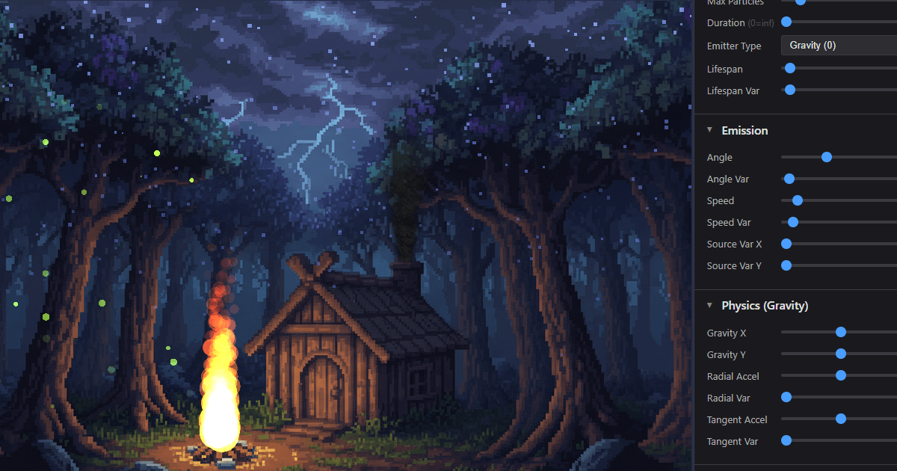

# Solar2D Particle Editor

A browser-based particle effect editor for [Solar2D](https://solar2d.com/) - create, customize, and export particle emitters with real-time preview, built-in templates, and full scene composition.

**Note**: The particle editor is still in beta. It has a few known issues and its UI and features may change. Thank you for your patience.

**[Interactive Demo](https://xedur.github.io/solar2d-particle-editor/)**



## What Is This?

Solar2D Particle Editor is an interactive tool for designing particle effects for games and applications built with Solar2D (formerly Corona SDK). It runs entirely in the browser with no installation or build step required. You get real-time preview of your effects, built-in effect and scene templates to start from, and can export your work as JSON files ready to drop into any Solar2D project.

The editor supports multiple emitters and background images in a single scene, drag-and-drop layer ordering, full undo/redo history, and automatic session saving - so you never lose your work.

## Features

### Emitter Editing
- **Extensive adjustable parameters** with paired slider and number inputs for precision
- Two emitter types: **Gravity** (linear motion with physics) and **Radial** (orbital motion)
- Full **RGBA color control** with start/end colors and per-channel variance
- Particle **size**, **lifespan**, **speed**, **rotation**, and **acceleration** with variances
- **Custom texture upload** (PNG) or choose from a large library of built-in particle textures
- **Blend mode presets**: Additive, Normal, Multiply, Screen, or custom OpenGL blend functions

### Scene Composition
- Combine **multiple emitters and background images** in a single scene
- **Drag-and-drop reordering** to control layer depth
- **Duplicate**, **rename**, and **delete** objects inline
- Per-image **position**, **scale**, and **opacity** controls
- Built-in background image presets for quick scene mockups

### Visualization
- **Real-time particle preview** with play, pause, and restart controls
- **Zoom** (scroll wheel) and **pan** (right-drag) the canvas
- Toggleable **grid overlay** with adjustable size (8-128 px)
- **Emitter bounds display**: visualize source variance, radius, and emission angle
- Drag emitters to reposition them on the canvas

### Import & Export
- Export emitter as **JSON** (Solar2D-compatible format with embedded texture)
- Export emitter as **PNG** screenshot
- Export emitter as **ZIP** (JSON + texture + manifest)
- **Batch export** all emitters as a single ZIP
- **Import** custom emitter templates from JSON files

### Persistence
- **Save and load scenes** with all emitters, images, and settings
- **Preset scenes** included for quick inspiration
- **Autosave** every 15 seconds (toggleable)
- **Session restore** on page reload (up to 48 hours)
- All data stored locally in the browser - nothing is uploaded

## Keyboard Shortcuts

| Key | Action |
|-----|--------|
| Ctrl+Z | Undo |
| Ctrl+Y | Redo |
| Ctrl+Shift+Z | Redo (alternative) |
| Delete | Delete selected object |
| Escape | Close dialog |

## Built-in Templates

The editor includes ready-to-use **emitter templates** (fire, rain, explosions, vortexes, and more) and **scene templates** that combine multiple emitters and background images into complete compositions. Each emitter template sets all parameters at once, giving you a complete effect that you can then fine-tune.

## Getting Started

No build step required. Serve the project folder with any static HTTP server:

```bash
# Python
python -m http.server 8000

# Node.js (npx)
npx serve .

# Or use XAMPP, Nginx, Apache, etc.
```

Then open `http://localhost:8000` in your browser.

## Project Structure

```
├── index.html              Main page (UI layout and controls)
├── css/
│   └── styles.css          UI styling (dark theme, responsive, scalable)
├── js/
│   └── app.js              Frontend logic (state, bridge, UI, export)
├── solar2d/
│   ├── bin/                HTML5 build output (loaded via iframe)
│   │   ├── index.html      Solar2D app loader
│   │   ├── particleEditor.bin
│   │   └── particleEditor.data
│   └── src/                Solar2D Lua source
│       ├── main.lua        Entry point (canvas, zoom/pan, drag)
│       ├── config.lua      Solar2D display configuration
│       ├── jsBridgeHost.js JS→Lua command queue
│       ├── parentBridge.js Lua→JS event dispatcher
│       ├── classes/
│       │   ├── emitterManager.lua   Emitter lifecycle and state
│       │   ├── imageManager.lua     Background image management
│       │   ├── history.lua          Undo/redo stack (50 states)
│       │   ├── jsBridge.lua         Lua-side bridge and handlers
│       │   ├── templates.lua        Built-in effect templates
│       │   ├── screen.lua           Display utility module
│       │   ├── utils.lua            Deep copy, base64, file I/O
│       │   ├── manifestGenerator.lua  Asset manifest generator (Simulator only)
│       │   └── handlers/            JS bridge command handlers
│       │       ├── emitterHandlers.lua
│       │       ├── imageHandlers.lua
│       │       ├── sceneHandlers.lua
│       │       └── viewHandlers.lua
│       └── assets/
│           ├── particles/  Built-in particle texture PNGs
│           ├── images/     Background image presets
│           └── scenes/     Preset scene JSON files
└── images/
    └── GitHub_Lockup_White.svg
```

## How It Works

The editor is split into two layers:

- **Frontend** (`index.html`, `app.js`, `styles.css`) - handles the UI, parameter controls, scene management, file export, and local storage persistence.
- **Backend** (Solar2D Lua in `solar2d/src/`) - handles particle rendering, emitter state, image display, undo/redo history, and the canvas viewport.

The Solar2D HTML5 build runs inside an `<iframe>`. The two layers communicate via a `postMessage` bridge: the frontend sends commands to Lua (e.g. "set parameter", "create emitter"), and Lua dispatches events back (e.g. "emitter selected", "history changed"). This keeps the rendering engine isolated while giving the HTML page full control over the UI.

## Author

[© 2025-2026 Eetu Rantanen](https://www.erantanen.com)

## License

MIT
